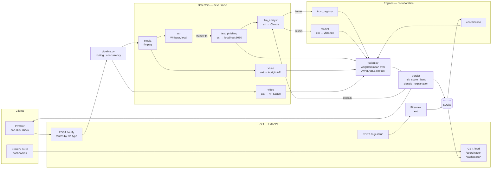
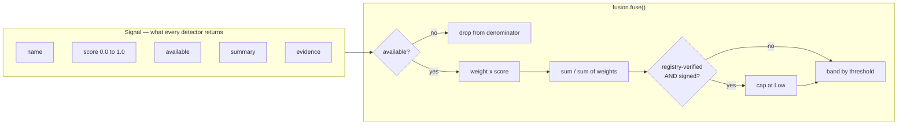
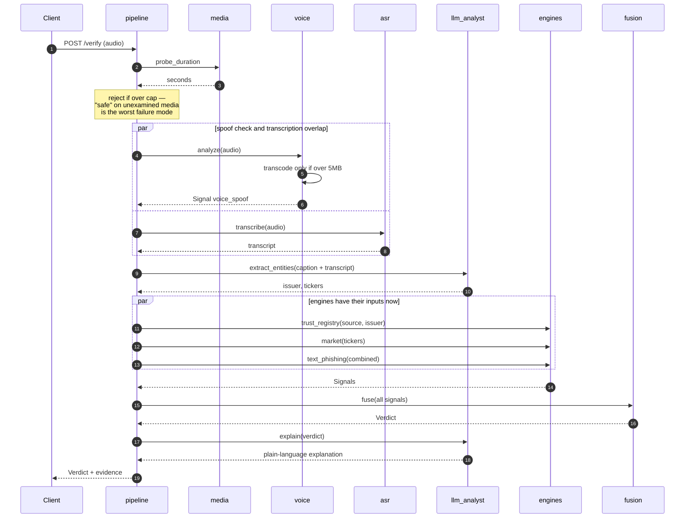
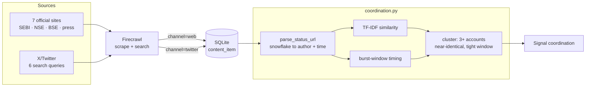
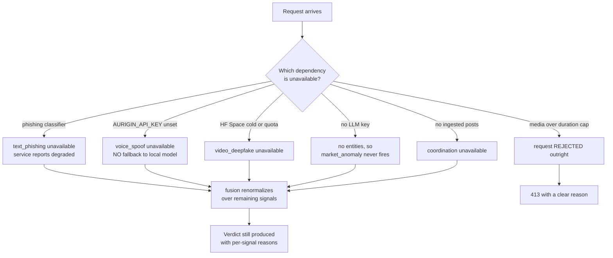

# APIF — System Architecture

AI Propaganda Intelligence Framework. Detects AI-generated market propaganda and verifies
genuine market communications.

Every detector returns a **Signal**; the fusion engine turns a list of Signals into a
**Verdict**. Nothing else crosses module boundaries — that single contract is what lets
detectors fail independently without taking the verdict with them.

**Editable whiteboard versions** (open at [excalidraw.com](https://excalidraw.com) →
*Open* → pick the file):

| File | Audience |
|---|---|
| [diagrams/apif-overview-simple.excalidraw](diagrams/apif-overview-simple.excalidraw) | Non-technical — judges, investors. Four steps, no jargon. |
| [diagrams/apif-architecture-technical.excalidraw](diagrams/apif-architecture-technical.excalidraw) | Technical — components, external services, failure behaviour. |

Both are generated by [diagrams/generate.py](diagrams/generate.py); re-run it after
editing that script rather than hand-placing boxes, so the layout stays reproducible.

---

## 1. System overview

Each detector's external dependency is shown inline with an arrow. Everything marked
`ext` runs off this machine.



---

## 2. The Signal contract

The load-bearing design decision: **an unavailable detector is excluded and the weights
renormalized — never scored 0.** A dead detector must never read as "clean."



**Weights** — `text_phishing` .25 · `voice_spoof` .20 · `video_deepfake` .20 ·
`source_untrusted` .15 · `coordination` .10 · `market_anomaly` .10

**Bands** — Low < 0.30 · Medium ≥ 0.30 · High ≥ 0.60 · Critical ≥ 0.80

---

## 3. Request flow — audio, the most concurrent path

Ordering here is deliberate, not incidental. Media collapses to text *first* so a vishing
call and a phishing email travel the same path afterward; entity extraction runs *before*
the registry and market engines because it supplies their inputs.



---

## 4. Ingestion and coordination

Coordination is a property of a *campaign*, not of one artefact, so it is computed against
everything ingested rather than the submitted content alone.



Author and timestamp are recovered from the tweet URL itself — the handle sits in the
path, and the status ID is a snowflake whose upper 41 bits are a millisecond timestamp.
No Twitter API required.

---

## 5. Failure behaviour

What happens when each dependency is down. `degraded` means a signal is missing, not that
the service is broken.



The voice detector deliberately has **no fallback** to the previous local checkpoint: that
model was uncalibrated and scored genuine recordings as 100% spoof. A confidently wrong
answer is worse than an absent one.

---

## 6. Module layout

```
apif/
  main.py          FastAPI app, /health, 413 handler
  config.py        all tunables + .env loading
  schemas.py       Signal / Verdict — the only types crossing boundaries
  compat.py        inspect.getmodule patch for lazy ML imports; loads first
  pipeline.py      orchestration: routing, concurrency, fan-out
  detectors/       text_phishing, llm_analyst, asr, voice, video, media
  engines/         fusion, trust_registry, market, coordination
  ingest/          firecrawl, exchanges, store (SQLite)
  data/            trusted_sources.json
tests/             test_engines.py
```
