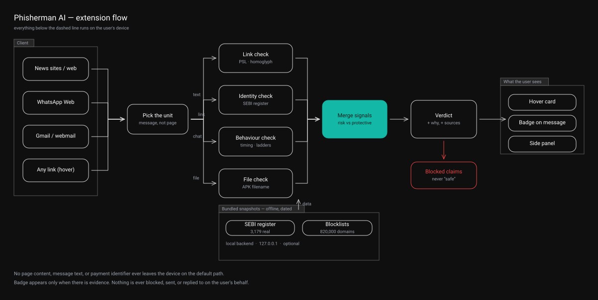
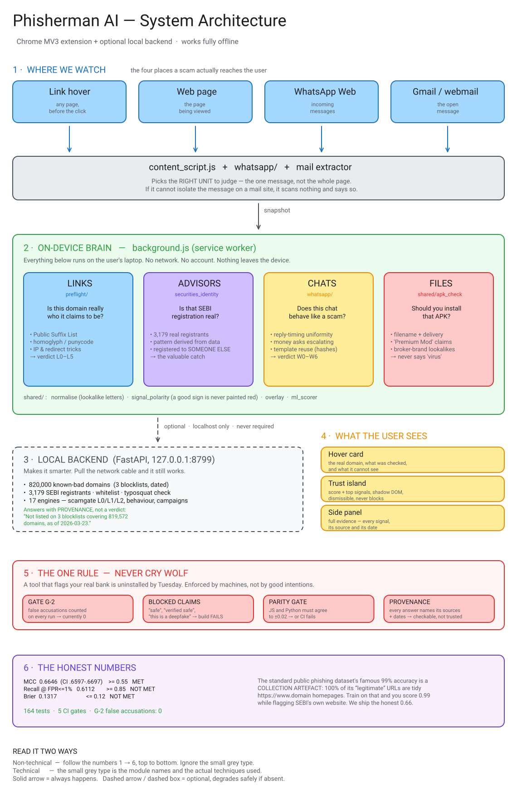

# Phisherman AI

**A Chrome extension that warns Indian retail investors about securities fraud — before they click, install, or pay.**

Built for **SEBI Securities Market Hackathon — PS-01**, *AI-Driven Detection of Synthetic Media and Phishing Attacks in Securities Markets*.

No build step · No npm · Works with the network off · Nothing leaves your device

[Architecture](#architecture) · [Try it in 5 minutes](#try-it-in-5-minutes) · [The numbers](#the-numbers-including-the-bad-ones) · [Evaluation report](eval/REPORT.md)

---

## The problem, in one message

Someone sends your uncle a WhatsApp message:

> *"SEBI-registered advisor. Guaranteed 40% returns. VIP group closing today. Pay to `investprofit99@ybl`."*

Then a file: `Zerodha_Kite_Pro_Unlocked.apk`. Then a link that looks almost exactly like his broker's site.

He loses his savings.

## Why the usual approach fails

Most scam blockers keep a list of known-bad websites. That list is always a day behind — fraudsters change domains daily, and by the time a domain is on a blocklist it has done its work.

**We ask a different question.**

SEBI requires every legitimate adviser, broker and research analyst to display a registration number, and to take money only through a verified `@valid` UPI handle. So instead of hunting for signs of a scam, we check whether **the credential the law requires is actually there — and whether it really belongs to whoever is showing it.**

That puts a scammer in a trap with no exit:

| They... | And then |
|---|---|
| **Keep** a registration number | We resolve it against the real SEBI register and catch that it belongs to *someone else* |
| **Remove** it | The page is breaking a disclosure rule mandatory since 1 May 2026 |

A fraudster can rewrite their sales pitch endlessly. They cannot fake a number that resolves to a real registered firm.

---

## Architecture

### The flow, end to end



Four inputs, one question each, merged into a single verdict that carries its own reasoning. Source: [`docs/architecture-extension.excalidraw`](docs/architecture-extension.excalidraw).

**Merge signals** is where four independent checks — which know nothing about each other — become one answer. Each finding gets classified by *its own meaning* (risk / protective / context), deduplicated, ordered worst-first, and combined with a **floor-only** rule: an APK finding can drag trust down, but a benign attachment can never lift a page that already looks dangerous.

**Verdict** is not a score. It's a code plus its evidence plus its provenance — and every finding stays tagged with which of four truths it speaks to: *identity*, *content*, *channel*, *interaction*. They're never collapsed into one number, because "this chat behaves oddly" and "this registration belongs to someone else" are different claims with different consequences.

### The full system



Source: [`docs/architecture.excalidraw`](docs/architecture.excalidraw). Regenerate both with:

```bash
python scripts/gen_extension_flow.py && python scripts/gen_architecture_diagram.py
python scripts/excalidraw_to_svg.py --all
```

### The four lanes

| Lane | Question | How |
|---|---|---|
| **Links** `preflight/` | Is this domain really who it claims? | Public Suffix List, so `paytm.evil.co.in` resolves to `evil.co.in`. Homoglyph and punycode detection. IP literals in decimal/octal/hex. Redirect chains. |
| **Advisors** `securities_identity` | Is that SEBI number real? | 3,179 real registrants scraped from SEBI's public register (IA + RA categories). Pattern **derived from the data**, with a load-time assertion it matches every row. |
| **Chats** `whatsapp/` | Does this chat behave like a scam? | Reply-timing uniformity, escalating money asks, template reuse across groups — computed from timing and hashes, without reading content. |
| **Files** `shared/apk_check` | Should you install that APK? | Filename + delivery channel. `Spotify (Premium) Mod2.apk` → app file sent in chat, advertises a paid app unlocked free. |

> **One design call worth calling out.** We deliberately do *not* fold lookalike letters when comparing identity. Folding makes Cyrillic `nsеindia.com` compare **equal** to the real NSE domain — the tool would actively vouch for the impostor. Missing an attack is bad; endorsing one is worse.

---

## The one rule everything obeys

**Never cry wolf.** A tool that flags your real bank gets uninstalled by Tuesday.

This is enforced by machines, not good intentions:

| Gate | What it does |
|---|---|
| **G-2** | Counts false accusations on every eval run. Target 0. **Currently 0.** |
| **Blocked claims** | `"safe"`, `"verified safe"`, `"guaranteed protection"`, `"this is a deepfake"` cannot appear in user-facing text. **The build fails.** |
| **Parity** | The JS and Python feature implementations must agree to ±0.02, or CI fails |
| **Reachability** | A module that is built and never loaded fails the suite — twice caught real dead code |
| **Provenance** | Every answer names its sources and dates |

That last one is the difference between a shrug and an answer. A clean link doesn't say "Safe ✓". It says:

```
Checked — www.marxists.org
Not listed on 3 blocklists covering 819,572 domains, as of 2026-03-23.
A domain registered since then would not appear.
```

Dated, checkable, and honest about what it can't see.

---

## Try it in 3 minutes

```bash
# 1. Load the extension
chrome://extensions/ → Developer mode → Load unpacked → select extension/

# 2. Serve the demo pages
python -m http.server 8801

# Phisherman AI — Browser Guard

A small, local-first browser extension and optional backend that helps spot securities-related scams and phishing aimed at Indian retail investors.

This repo contains the extension (`extension/`), an optional FastAPI backend (`backend/`), evaluation scripts (`eval/`), and supporting data and models.

Why it exists: instead of guessing which pages are malicious, the tool checks whether the legally required credentials are present and valid (SEBI registration numbers, verified UPI handles), and surfaces clear, dated evidence for every finding.

Quick start
----------
- Load the extension: open `chrome://extensions/`, enable *Developer mode*, click *Load unpacked* and pick the `extension/` folder.
- Serve demos: `python -m http.server 8801` and open `http://localhost:8801/demo/`.
- Optional backend: `cd backend && pip install -r requirements.txt && uvicorn main:app --host 127.0.0.1 --port 8799`.

Regenerating evaluation artifacts
---------------------------------
Evaluation outputs like `eval/REPORT.md` are generated by `python eval/run_eval.py`. Generated reports and JSON are not committed (they are ignored by `.gitignore`).

Contributing
------------
- Run tests: `python -m pytest -q`
- Keep user-facing copy conservative: the UI must not claim absolute safety. See `scripts/check_blocked_claims.py` for the automated guard.

Where to look next
------------------
- Extension code: `extension/`
- Backend API: `backend/`
- Data and fixtures: `data/` and `eval/fixtures/`
- Models: `models/`

If you'd like, I can also tidy other docs, remove additional generated artifacts, or add a CONTRIBUTING.md explaining how to run tests locally.
### Hover any link
