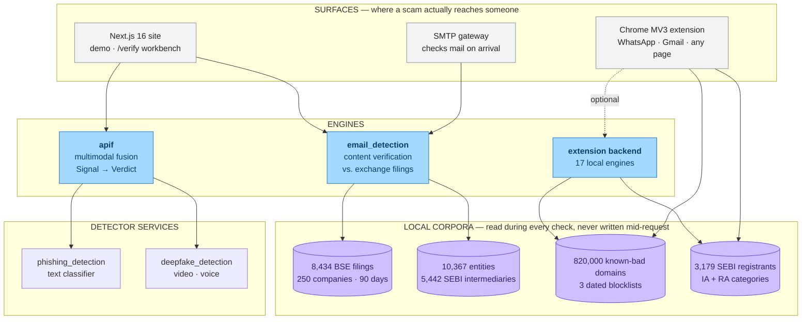
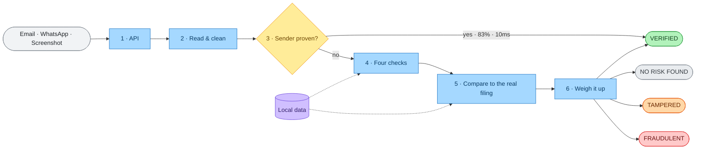
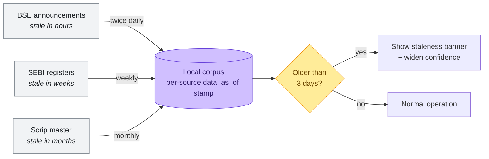
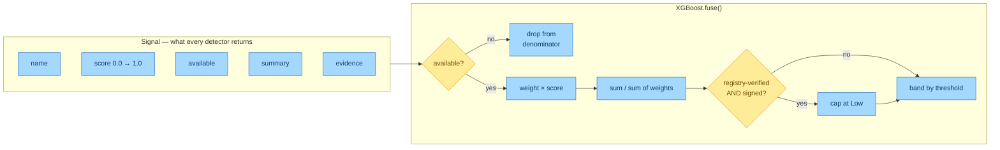
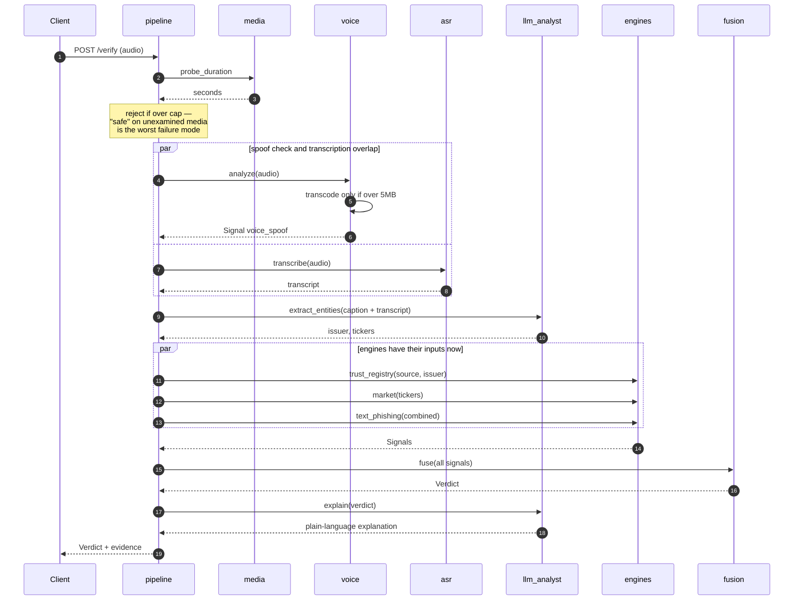
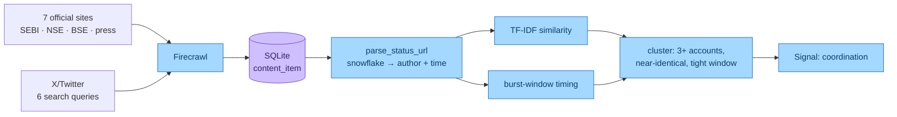

<div align="center">

# PhishermanAI

**Spot the Shadow. Empower the Investor. Strike the Scam.**

A verification stack for Indian retail investors that answers a question no deployed
anti-phishing system asks — not _where did this message come from_, but **is what it says true?**

<br/>


</div>

---

<br/>

**Contents** — [Architecture](#the-system-at-a-glance) · [Repository map](#repository-map) ·
[Verification engine](#1--email_detection--the-verification-engine) ·
[Fusion framework](#2--apif--multimodal-fusion) ·
[Browser guard](#3--extension_new--the-browser-guard) ·
[Website](#4--phishermanai_website--the-surface) ·
[Design rules](#the-rules-everything-obeys) · [Running it](#running-it) ·
[Results](#results--the-honest-numbers) · [Limitations](#limitations)

---

## The system at a glance

Three independent engines, four surfaces, one contract. Every engine degrades on its own
without taking the verdict with it.



---

## Repository map

| Module                                               | What it is                                                                           | Stack                               | Port   |
| ---------------------------------------------------- | ------------------------------------------------------------------------------------ | ----------------------------------- | ------ |
| **[`email_detection/`](email_detection/)**           | The verification engine. Compares a message against what the company actually filed. | FastAPI · Python 3.11+              | `8000` |
| **[`apif/`](apif/)**                                 | AI Propaganda Intelligence Framework. Fuses six detectors into one threat score.     | FastAPI · torch (CPU)               | `8000` |
| **[`Extension_new/`](Extension_new/)**               | Chrome MV3 extension + optional local backend. Four detection lanes.                 | Vanilla JS · FastAPI                | `8799` |
| **[`phishermanai_website/`](phishermanai_website/)** | Marketing site, live demo console, `/verify` workbench.                              | Next.js 16 · React 19 · Tailwind v4 | `3000` |
| **[`phishing_detection/`](phishing_detection/)**     | Standalone text classifier consumed by `apif`.                                       | FastAPI                             | `8080` |
| **[`deepfake_detection/`](deepfake_detection/)**     | Reference video + voice scripts. `apif/` holds the refactored versions.              | Python                              | —      |
| **[`fake_propaganda/`](fake_propaganda/)**           | The original brief, plan, and architecture notes.                                    | docs                                | —      |

---

## 1 · `email_detection` — the verification engine

The differentiator. Every other module answers _does this look like a scam?_ This one answers
_does this match the filing?_

### The journey of one message

Solid arrows are the message; dashed arrows are lookups against local data.
**No step touches the internet.**



| Step                      | What happens                                                                                              |
| ------------------------- | --------------------------------------------------------------------------------------------------------- |
| **1 · API**               | Three channels, one engine — `.eml`, pasted text, screenshot                                              |
| **2 · Read & clean**      | Parse, strip hidden text, mask demat / PAN / phone, unwrap forwards                                       |
| **3 · Sender proven?**    | Valid _aligned_ DKIM from a known domain answers immediately. **83% of genuine mail exits here in 10 ms** |
| **4 · Four checks**       | Entity · Money · Claim · Delivery, against real registers                                                 |
| **5 · Compare to filing** | Field-by-field against the BSE announcement — the differentiator                                          |
| **6 · Weigh it up**       | Two-tier findings, safety rail, confidence gates                                                          |

> **Editable diagrams** — [`system-overview.excalidraw`](email_detection/docs/system-overview.excalidraw) ·
> [`architecture.excalidraw`](email_detection/docs/architecture.excalidraw) ·
> [`data-refresh.excalidraw`](email_detection/docs/data-refresh.excalidraw).
> Open at [excalidraw.com](https://excalidraw.com) → _Open_ → pick the file.

### Tamper detection — the part nothing deployed does

A genuine dividend circular, from a real company, with **one number edited**. Every
authentication check passes, because nothing about the sender is fake.

```diff
  Birla Corporation — Dividend Circular
- This document says:      ₹125.00 per share
+ Birla Corporation filed: ₹12.50  per share    (BSE, 09 July 2026)
```

Two rules govern it:

- **Python compares, models do not.** Whether `125` equals `12.50` is an integer comparison,
  never a model's judgement.
- **An unreadable field can never produce "tampered."** A false accusation against a real
  document destroys credibility faster than a miss.

### Four outcomes, never two

| Verdict              | Meaning                                                                |
| :------------------- | :--------------------------------------------------------------------- |
| 🟢 **VERIFIED**      | Proven sender, or passing checks outnumber weak findings               |
| ⚪ **NO RISK FOUND** | Sender unconfirmed, but nothing asks for anything. _Not an accusation_ |
| 🟠 **TAMPERED**      | Matches a real filing, but a field was altered                         |
| 🔴 **FRAUDULENT**    | One disqualifying finding, or two weak ones alongside a request        |

A system that only knows _safe_ and _scam_ has to guess on everything it has not seen.
**NO RISK FOUND is what makes the other three trustworthy.**

### Rules match direction, not vocabulary

```
"The system will authenticate the user by sending OTP on registered Mobile"   harmless
"Please share the OTP with me"                                               severity 5
```

Same keywords. Only **direction** separates them. Every rule must declare an `entity`, an
`action`, a `direction` and `suppressors` — the engine _raises_ if a rule with no action is
given a severity above 1.

### Keeping local data current

Different sources decay at very different rates. Stale data **fails safe** — it can make the
system less certain, never falsely confident.



Every verdict carries `data_as_of` — _"as of 8 Aug 2026, 18:30"_. Registry entries are
**never auto-inserted**; a wrong one is a permanent false VERIFIED.

### API surface

| Method       | Path                                     | Purpose                                 |
| ------------ | ---------------------------------------- | --------------------------------------- |
| `POST`       | `/verify`                                | Verify a message, file or link          |
| `POST`       | `/verify/email`                          | Verify an `.eml`                        |
| `GET`        | `/entity/{name}`                         | Entity lookup + official channels       |
| `GET`        | `/stats`                                 | Aggregate statistics and fraud clusters |
| `GET`        | `/warning-card/{hash}`                   | Shareable warning card PNG              |
| `GET`        | `/gateway/messages`                      | Mail processed by the SMTP gateway      |
| `GET`        | `/health`                                | Health + corpus readiness               |
| `GET`·`POST` | `/demo/examples` · `/demo/verify/{name}` | Built-in fixtures                       |

---

## 2 · `apif` — multimodal fusion

Detects AI-generated market propaganda across **text, voice, video, social and market data**,
and verifies genuine market communications.

Every detector returns a **`Signal`**; the fusion engine turns a list of Signals into a
**`Verdict`**. Nothing else crosses module boundaries — that single contract is what lets
detectors fail independently.

### The Signal contract

> **The load-bearing design decision:** an unavailable detector is **excluded and the weights
> renormalized — never scored 0.** A dead detector must never read as "clean."



**Weights** — `text_phishing` .25 · `voice_spoof` .20 · `video_deepfake` .20 ·
`source_untrusted` .15 · `coordination` .10 · `market_anomaly` .10

**Bands** — `Low` < 0.30 · `Medium` ≥ 0.30 · `High` ≥ 0.60 · `Critical` ≥ 0.80

One override encodes a fact a linear model cannot: **registry-verified + digitally signed →
capped at Low.** A signed SEBI circular is not "somewhat suspicious" because its wording
scored high.

### Request flow — audio, the most concurrent path

Ordering is deliberate. Media collapses to text _first_ so a vishing call and a phishing email
travel the same path afterward; entity extraction runs _before_ the registry and market engines
because it supplies their inputs.



### Coordinated-campaign detection, without the Twitter API

Coordination is a property of a _campaign_, not of one artefact — so it is computed against
everything ingested, not the submitted content alone.



Author and timestamp are recovered **from the tweet URL itself** — the handle sits in the
path, and the status ID is a snowflake whose upper 41 bits are a millisecond timestamp.
No Twitter API required.

### Failure behaviour

`degraded` means a signal is missing, not that the service is broken.

| Dependency down         | Consequence                                                    |
| ----------------------- | -------------------------------------------------------------- |
| Phishing classifier     | `text_phishing` unavailable · service reports `degraded`       |
| `AURIGIN_API_KEY` unset | `voice_spoof` unavailable — **no fallback to the local model** |
| HF Space cold / quota   | `video_deepfake` unavailable                                   |
| No LLM key              | No entities → `market_anomaly` never fires                     |
| No ingested posts       | `coordination` unavailable                                     |
| Media over duration cap | **413** — request rejected outright                            |

The voice detector deliberately has **no fallback** to the previous local checkpoint: that
model was uncalibrated and scored genuine recordings as 100% spoof. _A confidently wrong
answer is worse than an absent one._

The duration cap returns **413 rather than an unscored `Low`** — a green band on content
nothing examined is the worst failure mode this system could have.

---

## 3 · `Extension_new` — the browser guard

**No build step · No npm · Works with the network off · Nothing leaves the device.**

### The flow, end to end


Four inputs, one question each, merged into a single verdict that carries its own reasoning.
Source: [`docs/architecture-extension.excalidraw`](Extension_new/docs/architecture-extension.excalidraw).

**Merge signals** is where four independent checks — which know nothing about each other —
become one answer. Each finding is classified by _its own meaning_ (risk / protective /
context), deduplicated, ordered worst-first, and combined with a **floor-only** rule: an APK
finding can drag trust down, but a benign attachment can never lift a page that already looks
dangerous.

**Verdict is not a score.** It's a code plus its evidence plus its provenance — and every
finding stays tagged with which of four truths it speaks to: _identity_, _content_, _channel_,
_interaction_. They are never collapsed into one number, because "this chat behaves oddly" and
"this registration belongs to someone else" are different claims with different consequences.

### The full system


Source: [`docs/architecture.excalidraw`](Extension_new/docs/architecture.excalidraw). Regenerate both with:

```bash
python scripts/gen_extension_flow.py && python scripts/gen_architecture_diagram.py
python scripts/excalidraw_to_svg.py --all
```

### The four lanes

| Lane                               | Question                             | How                                                                                                                                                              |
| ---------------------------------- | ------------------------------------ | ---------------------------------------------------------------------------------------------------------------------------------------------------------------- |
| **Links** `preflight/`             | Is this domain really who it claims? | Public Suffix List, so `paytm.evil.co.in` resolves to `evil.co.in`. Homoglyph + punycode detection. IP literals in decimal/octal/hex. Redirect chains. → `L0–L5` |
| **Advisors** `securities_identity` | Is that SEBI number real?            | 3,179 real registrants scraped from SEBI's public register. Pattern **derived from the data**, with a load-time assertion it matches every row.                  |
| **Chats** `whatsapp/`              | Does this chat behave like a scam?   | Reply-timing uniformity, escalating money asks, template reuse across groups — computed from timing and hashes, **without reading content**. → `W0–W6`           |
| **Files** `shared/apk_check`       | Should you install that APK?         | Filename + delivery channel. `Spotify (Premium) Mod2.apk` → app file sent in chat, advertises a paid app unlocked free. Never says "virus".                      |

### Why credentials, not blocklists

Most scam blockers keep a list of known-bad websites. That list is always a day behind.
SEBI requires every legitimate adviser to display a registration number and take money only
through a verified `@valid` UPI handle. So the extension checks whether **the credential the
law requires is actually there — and whether it really belongs to whoever is showing it.**

| They...                        | And then                                                                                 |
| ------------------------------ | ---------------------------------------------------------------------------------------- |
| **Keep** a registration number | We resolve it against the real SEBI register and catch that it belongs to _someone else_ |
| **Remove** it                  | The page breaks a disclosure rule mandatory since 1 May 2026                             |

A fraudster can rewrite their sales pitch endlessly. **They cannot fake a number that resolves
to a real registered firm.**

> **One design call worth calling out.** We deliberately do _not_ fold lookalike letters when
> comparing identity. Folding makes Cyrillic `nsеindia.com` compare **equal** to the real NSE
> domain — the tool would actively vouch for the impostor. Missing an attack is bad;
> endorsing one is worse.

---

## 4 · `phishermanai_website` — the surface

Next.js 16 (App Router) · React 19 · TypeScript · Tailwind v4 · shadcn/ui.

| Route           | What's there                                                     |
| --------------- | ---------------------------------------------------------------- |
| `/`             | Hero, threat landscape, all five channels, auth framework, gates |
| `/verify`       | The workbench — drop an `.eml`, paste text, get a PDF report     |
| `/how-it-works` | Routing, fusion, the messaging pipeline, data freshness          |
| `/features`     | Every channel's full capability list                             |
| `/evidence`     | Metrics, the precision ablation, every stated limitation         |
| `/demo`         | Four recorded fixtures + an in-browser rule preview              |
| `/apif`         | The backend routes exposed by the verification engine            |

**Requests go through a proxy, not straight to the engine.** The browser calls
`/api/engine/*` and [`route.ts`](phishermanai_website/src/app/api/engine/) forwards it. The
engine's CORS already permits `localhost:3000`, so this isn't required — it keeps the engine's
address server-side instead of in the client bundle, and means deploying the UI elsewhere
needs no CORS change on the Python side.

The demo console probes `/health` on load and picks its mode:

| Engine      | Fixtures tab                                   | Your-own-text tab      |
| ----------- | ---------------------------------------------- | ---------------------- |
| **running** | `POST /demo/verify/{name}` — the real pipeline | `POST /verify`         |
| **down**    | recorded results                               | in-browser rule subset |

Either way the console says which mode it's in. **The in-browser preview is deliberately a
subset** — it can only reach `FRAUDULENT` or `NO_RISK_FOUND`, because it can't prove a sender
or check a filing, and it says so on screen.

---

## The rules everything obeys

These are the decisions that survived contact with real data.

<table>
<tr><td width="34%"><b>An unavailable detector is excluded, never scored 0</b></td>
<td>Weights renormalize over what actually ran. A dead detector must never read as evidence of innocence.</td></tr>

<tr><td><b>Python compares, models do not</b></td>
<td>Whether ₹125.00 equals ₹12.50 is an integer comparison. Models extract; they never adjudicate.</td></tr>

<tr><td><b>An unreadable field can never produce "tampered"</b></td>
<td>A false accusation against a real document destroys credibility faster than a miss.</td></tr>

<tr><td><b>Four outcomes, never two</b></td>
<td><code>NO RISK FOUND</code> — a calibrated "I don't know, and here's what I'd have needed" — is what makes the other three trustworthy.</td></tr>

<tr><td><b>Direction, not vocabulary</b></td>
<td>"OTP will be sent to you" vs "share the OTP with me". Same keywords, opposite intent.</td></tr>

<tr><td><b>Never cry wolf</b></td>
<td>A tool that flags your real bank is uninstalled by Tuesday. Enforced by CI gates, not good intentions.</td></tr>

<tr><td><b>Never fold lookalikes when comparing identity</b></td>
<td>Folding makes Cyrillic <code>nsеindia.com</code> equal the real NSE domain. Missing an attack is bad; endorsing one is worse.</td></tr>

<tr><td><b>Reject rather than under-score</b></td>
<td>Media over the duration cap returns <b>413</b>. A green band on content nothing examined is the worst possible failure.</td></tr>

<tr><td><b>Provenance, not verdicts</b></td>
<td>"Not listed on 3 blocklists covering 819,572 domains, as of 2026-03-23. A domain registered since then would not appear."</td></tr>
</table>

### Enforced by machines

| Gate               | What it does                                                                                                                           |
| ------------------ | -------------------------------------------------------------------------------------------------------------------------------------- |
| **G-2**            | Counts false accusations on every eval run. Target 0. **Currently 0.**                                                                 |
| **Blocked claims** | `"safe"`, `"verified safe"`, `"guaranteed protection"`, `"this is a deepfake"` cannot appear in user-facing text. **The build fails.** |
| **Parity**         | JS and Python feature implementations must agree to **±0.02**, or CI fails                                                             |
| **Reachability**   | A module built and never loaded fails the suite — twice caught real dead code                                                          |
| **Golden corpus**  | 155 genuine samples run as a _blocking_ test. If a rule goes direction-blind, the build fails.                                         |

---

## Running it

> **Port collision:** `email_detection` and `apif` both default to `:8000`. Run one on `:8001`
> if you need both up at once.

<details open>
<summary><b>1 · The verification engine</b> — <code>email_detection/</code></summary>

```bash
cd email_detection
pip install -e .                    # core (email path)
pip install -e ".[image,ocr]"       # optional: screenshot path
pip install -e ".[dev]"             # tests

python -m data.load_all             # build the DB from committed cache — offline, ~30s
uvicorn api.main:app --reload       # http://127.0.0.1:8000/docs
```

Everything the demo needs is cached in `data/cache/`. **The demo runs with the network
unplugged.**

</details>

<details>
<summary><b>2 · The fusion framework</b> — <code>apif/</code></summary>

```powershell
python -m venv .venv --system-site-packages
.\.venv\Scripts\pip install -r requirements.txt
# torchaudio must match the globally installed torch (2.7.1), or its C extension
# fails with "OSError: [WinError 127]":
.\.venv\Scripts\pip install --index-url https://download.pytorch.org/whl/cpu torchaudio==2.7.1

# The external phishing classifier must be up first — GET http://127.0.0.1:8080/health
.\.venv\Scripts\python -m uvicorn apif.main:app --reload --port 8000
```

| Key                 | Required?     | Effect if unset                                                                                 |
| ------------------- | ------------- | ----------------------------------------------------------------------------------------------- |
| `PHISHING_API_URL`  | **yes**       | Text scoring unavailable — the core signal                                                      |
| `ANTHROPIC_API_KEY` | recommended   | No entity extraction → **market correlation never fires**; explanations fall back to a template |
| `FIRECRAWL_API_KEY` | for ingestion | `/api/v1/ingest/run` errors; on-demand analysis still works                                     |
| `AURIGIN_API_KEY`   | for voice     | `voice_spoof` reports unavailable; fusion renormalizes                                          |

`GET /health` reports every downstream. `status: "degraded"` means an optional dependency is
down, not that the service is broken.

</details>

<details>
<summary><b>3 · The extension</b> — <code>Extension_new/</code></summary>

```bash
# Load it — no build step
chrome://extensions/ → Developer mode → Load unpacked → select Extension_new/extension/

# Serve the demo pages
python -m http.server 8801        # http://localhost:8801/demo/

# Optional local backend
cd Extension_new/backend && pip install -r requirements.txt
uvicorn main:app --host 127.0.0.1 --port 8799
```

The backend makes it smarter. **Pull the network cable and it still works.**

</details>

<details>
<summary><b>4 · The website</b> — <code>phishermanai_website/</code></summary>

```bash
cd phishermanai_website
npm install
npm run dev       # http://localhost:3000
npm run build
npm run lint
```

Set `PHISHERMANAI_API_URL` to point somewhere other than `127.0.0.1:8000` — see
[`.env.example`](phishermanai_website/.env.example).

</details>

### Demo — four one-click examples, each deep-linkable

| Verdict       | URL                                                      |
| ------------- | -------------------------------------------------------- |
| VERIFIED      | `localhost:3000/?demo=genuine_01.eml`                    |
| **TAMPERED**  | `localhost:3000/?demo=tampered_01.eml`                   |
| FRAUDULENT    | `localhost:3000/?demo=fraud_02_guaranteed_returns.eml`   |
| NO RISK FOUND | `localhost:3000/?demo=edge_01_unregistered_but_real.eml` |

Spend the time on **TAMPERED** — the altered value beside the filed value is the whole point —
and close on **NO RISK FOUND**.

---

## Results — the honest numbers

Regenerated by script, never typed by hand.

### Verification engine — `email_detection`

| Metric                                | Result                                                      |
| ------------------------------------- | ----------------------------------------------------------- |
| Overall accuracy                      | **97.8%** (46 fixtures, four classes)                       |
| Fraud recall                          | **95%** (19/20)                                             |
| Tamper detection recall               | **70%** — nothing deployed does this check                  |
| **Tampered documents called genuine** | **0**                                                       |
| False positives, golden corpus        | **0 / 155** (incl. 35 adversarial)                          |
| Short-circuit rate                    | **83%** of genuine mail                                     |
| Median latency                        | **10 ms** short-circuit · **40 ms** full · ~3 s screenshots |
| Tests                                 | **213** passing                                             |

#### The precision ablation

Two precision mechanisms, measured independently over 155 genuine samples:

| Configuration              | FP rate  | Fraud recall |
| -------------------------- | -------- | ------------ |
| **Both enabled (shipped)** | **0.0%** | 95.0%        |
| Awareness suppression off  | 1.9%     | 95.0%        |
| Short-circuit off          | 0.0%     | 95.0%        |
| Both off — rules alone     | 3.9%     | 95.0%        |

**Precision cost nothing in recall** — 95% in every configuration. These are normally a trade;
here they were not. And every false positive under rules alone came from the adversarial set,
none from the other 120 samples: _investor-awareness copy is exactly where keyword systems fail._

### Browser guard — `Extension_new`

| Metric                | Result                      | Target |            |
| --------------------- | --------------------------- | ------ | ---------- |
| MCC                   | **0.6646** (CI .6597–.6697) | ≥ 0.55 | ✅ MET     |
| Recall @ FPR ≤ 1%     | 0.6112                      | ≥ 0.85 | ❌ NOT MET |
| Brier score           | 0.1317                      | ≤ 0.12 | ❌ NOT MET |
| G-2 false accusations | **0**                       | 0      | ✅ MET     |

Figures from the last recorded eval run (`eval/run_eval.py`). The 164-test unit suite that
backed the parity and reachability gates is not currently in the tree — see [Tests](#tests).

> **Why 0.66 and not 99%.** The standard public phishing dataset's famous 99% accuracy is a
> **collection artefact**: 100% of its "legitimate" URLs are tidy `https://www.domain`
> homepages. Train on that and you score 0.99 while flagging SEBI's own website.
> **We ship the honest 0.66.**

---

## Limitations

Stated plainly, because bounded claims are worth more than broad ones.

**Verification engine**

- **Filings cross-check covers listed-company corporate actions only.** The four chokepoints carry the wider fraud landscape.
- **The corpora are real-shaped but synthetic** — built from the structure of genuine notices, not sampled from real inboxes.
- **The domain map is hand-curated** (114 rows, DNS/MX verified) and does not yet scale. Entries are never auto-inserted; a wrong one is a permanent false VERIFIED.
- **Screenshots are weaker than email** — 7/10 against 16/16, because OCR on WhatsApp-compressed text runs words together.
- **Confidence constants are hand-tuned**, fitted to this fixture set rather than to labelled data.
- **Institutional integration is a roadmap item.** We scrape because we have no relationship with the exchanges; deployed, they would publish to the registry at issuance and verification would be instant rather than best-effort with a lag.

**Fusion framework**

- **The coordination engine is a heuristic** (TF-IDF + burst timing), not a trained GNN. There is no labelled bot dataset here; a GNN trained on nothing would be less trustworthy than a method you can explain to a regulator.
- **PDF signature checking proves presence, not validity.** Verifying the certificate chain against India's CCA trust store is out of scope. _Absence_ on a document claiming a mandated signature is the actionable finding.
- **The video detector is a free Hugging Face Space.** Cold starts and quota exhaustion are normal; it soft-fails to `available: false`.
- **No speaker verification.** The system can say audio is synthetic, but not _whose_ voice was cloned.
- **NSE blocks programmatic clients.** The cookie-priming workaround may break whenever NSE changes its edge config; `yfinance` carries the demo-critical path.

---

## Documentation

| Document                                                                                                           | Contents                                                             |
| ------------------------------------------------------------------------------------------------------------------ | -------------------------------------------------------------------- |
| **[email_detection/docs/HOW_IT_WORKS.md](email_detection/docs/HOW_IT_WORKS.md)**                                   | **Start here** — every step explained, and why                       |
| [ARCHITECTURE.md](ARCHITECTURE.md)                                                                                 | APIF system, request flow, failure behaviour                         |
| [email_detection/eval/RESULTS.md](email_detection/eval/RESULTS.md)                                                 | Confusion matrix, per-class precision/recall                         |
| [email_detection/eval/RESULTS_HARDENING.md](email_detection/eval/RESULTS_HARDENING.md)                             | Precision ablation over the golden corpus                            |
| [email_detection/extension/PRIVACY.md](email_detection/extension/PRIVACY.md)                                       | Exactly what leaves the browser                                      |
| [email_detection/gateway/SECURITY.md](email_detection/gateway/SECURITY.md)                                         | Gateway controls, and what is not hardened                           |
| [Extension_new/docs/DATA_SOURCES_2026.md](Extension_new/docs/DATA_SOURCES_2026.md)                                 | Every feed, its licence and refresh cadence                          |
| [Extension_new/docs/SECURITY_AND_LEGAL_CONTROL_MATRIX.md](Extension_new/docs/SECURITY_AND_LEGAL_CONTROL_MATRIX.md) | Control matrix                                                       |
| [Extension_new/ml/model_card.md](Extension_new/ml/model_card.md)                                                   | Model card                                                           |
| `*/docs/*.excalidraw`                                                                                              | Editable diagrams — open at [excalidraw.com](https://excalidraw.com) |

## Tests

```bash
# Verification engine — 213 tests, the blocking suite
cd email_detection && python -m pytest tests/ -q

python -m eval.run_eval           # fixture metrics → eval/RESULTS.md
python -m eval.run_golden         # 155 genuine samples, must be 0 FP
python -m eval.report_hardening   # the precision ablation
```

The golden corpus runs as a **blocking** test. If a rule becomes direction-blind and starts
firing on genuine institutional mail, the build fails.

```bash
# Browser guard — eval harness and CI gates
cd Extension_new
python eval/run_eval.py                    # metrics → eval/REPORT.md (not committed)
python eval/parity_test.py                 # JS vs Python, must agree to ±0.02
python eval/corpus_audit.py                # corpus composition audit
python scripts/check_blocked_claims.py     # blocked-claims gate
```

---

## 🚀 Meet the Team

**Shourya Wikhe** · [LinkedIn](https://www.linkedin.com/in/shourya-wikhe-7b5a642a2/)  
**Vinit Shirbhate** · [LinkedIn](https://www.linkedin.com/in/vinitshirbhate/)  
**Arhant Bagde** · [LinkedIn](https://www.linkedin.com/in/arhant-bagde/)  
**Vivek Latpate** · [LinkedIn](https://www.linkedin.com/in/vivek-latpate-2521112b8/)

---
