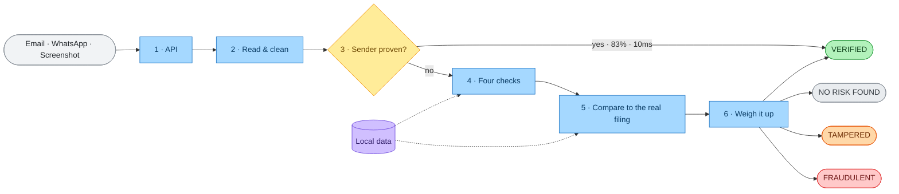

# PhishermanAI

**A verification engine for Indian retail investors.** It answers a question no
deployed anti-phishing system asks: not *where did this message come from*, but
**is what it says true?**

Built for SEBI Problem Statement 1 — *AI-Driven Detection of Synthetic Media and
Phishing Attacks in Securities Markets*.

| | |
|---|---|
| **8,434** real BSE filings | across 250 companies, 90 days |
| **10,367** entities | including 5,442 SEBI-registered intermediaries |
| **97.8%** accuracy · **95%** fraud recall | 46 labelled fixtures |
| **0 / 155** false positives | golden corpus, incl. 35 adversarial samples |
| **213** tests passing | runs offline · **no LLM required** |

---

## The gap this builds into

SPF, DKIM and DMARC are excellent at what they do. But consider precisely what a
DMARC pass asserts:

> *"This mail genuinely came from the domain it claims, and that domain's owner
> authorised it."*

That is all. It says nothing about whether the domain has any right to the **name**
it is trading under.

A fraudster who registers `canarabank-dividends.co.in`, publishes correct SPF and
DKIM records and sets a DMARC policy will **pass every authentication check in
existence** — while impersonating Canara Bank. Every mail provider marks it clean.

So PhishermanAI does both: source authentication **and** content verification
against what the company actually filed with the exchange. The second half is the
part nothing else does.

---

## How it works



Solid arrows are the journey of one message; dashed arrows are lookups against
local data. **No step touches the internet.**

1. **API** — three channels, one engine
2. **Read & clean** — parse, strip hidden text, mask demat IDs / PAN / phone numbers, unwrap forwards
3. **Sender proven?** — valid *aligned* DKIM from a known domain answers immediately. 83% of genuine mail exits here in 10 ms
4. **Four checks** — Entity · Money · Claim · Delivery, against real registers
5. **Compare to the real filing** — the differentiator
6. **Weigh it up** — two-tier findings, safety rail, confidence gates

**→ [docs/HOW_IT_WORKS.md](docs/HOW_IT_WORKS.md) explains each step and why it exists.**

---

## What makes it different

### Tamper detection

A genuine dividend circular, from a real company, with one number edited. Every
authentication check passes, because nothing about the sender is fake.

```
This document says:      ₹125.00 per share
Birla Corporation filed: ₹12.50 per share   (BSE, 09 July 2026)
```

Two rules govern it: **Python compares, models do not** — whether 125 equals 12.50
is an integer comparison, never a model's judgement. And **an unreadable field can
never produce "tampered"** — a false accusation against a real document destroys
credibility faster than a miss.

### Four outcomes, never two

| | |
|---|---|
| 🟢 **VERIFIED** | Proven sender, or passing checks outnumber weak findings |
| ⚪ **NO RISK FOUND** | Sender unconfirmed, but nothing asks for anything. *Not an accusation* |
| 🟠 **TAMPERED** | Matches a real filing, but a field was altered |
| 🔴 **FRAUDULENT** | One disqualifying finding, or two weak ones alongside a request |

A system that only knows *safe* and *scam* has to guess on everything it has not
seen. **NO RISK FOUND** is what makes the other three trustworthy.

### Rules match direction, not vocabulary

```
"The system will authenticate the user by sending OTP on registered Mobile"   harmless
"Please share the OTP with me"                                               severity 5
```

Same keywords. Only direction separates them. Every rule must declare an
**entity**, an **action**, a **direction** and **suppressors** — the engine raises
if a rule with no action is given a severity above 1.

---

## Setup

```bash
# 1. Python side
pip install -e .                    # core (email path)
pip install -e ".[image,ocr]"       # optional: screenshot path
pip install -e ".[gateway]"         # optional: SMTP gateway
pip install -e ".[dev]"             # tests

# 2. Build the database from the committed cache (offline, ~30 s)
python -m data.load_all

# 3. Run the API
uvicorn api.main:app --reload       # http://127.0.0.1:8000/docs

# 4. Run the web UI
cd web && npm install && npm run dev   # http://localhost:3000
```

Load the extension: Chrome → `chrome://extensions` → Developer mode →
**Load unpacked** → select `extension/`.

Everything the demo needs is already cached in `data/cache/`.
**The demo runs with the network unplugged.**

<details>
<summary>Refreshing the data (not needed for the demo)</summary>

```bash
python -m data.scrapers.run --source bse --days 90   # BSE announcements
python -m data.scrapers.bse_pdf                      # attachment text
python -m data.scrapers.sebi                         # SEBI registers
python -m data.load_all --reset
```

Different sources decay at very different rates — filings in hours, the SEBI
registry in weeks, the scrip master in months. Every verdict carries `data_as_of`,
and two guards make sure stale data can never produce a false accusation. See
[HOW_IT_WORKS.md](docs/HOW_IT_WORKS.md#the-data-and-keeping-it-current).
</details>

---

## Demo

Four one-click examples, each deep-linkable:

| Verdict | URL |
|---|---|
| VERIFIED | `localhost:3000/?demo=genuine_01.eml` |
| **TAMPERED** | `localhost:3000/?demo=tampered_01.eml` |
| FRAUDULENT | `localhost:3000/?demo=fraud_02_guaranteed_returns.eml` |
| NO RISK FOUND | `localhost:3000/?demo=edge_01_unregistered_but_real.eml` |

Spend the time on **TAMPERED** — the altered value beside the filed value is the
whole point — and close on **NO RISK FOUND**. Almost every competing system knows
only "safe" and "scam"; a calibrated *"I don't know, and here is exactly what I
would have needed"* is the harder and more useful answer.

---

## Results

Regenerated by script, never typed by hand.

| Metric | Result |
|---|---|
| Overall accuracy | **97.8%** (46 fixtures, four classes) |
| Fraud recall | **95%** (19/20) |
| Tamper detection recall | **70%** — the headline; nothing deployed does this check |
| **Tampered documents called genuine** | **0** |
| False positives, golden corpus | **0 / 155** (incl. 35 adversarial) |
| Short-circuit rate | **83%** of genuine mail |
| Median latency | **10 ms** short-circuit · **40 ms** full · ~3 s screenshots |

### The ablation

Two precision mechanisms, measured independently over 155 genuine samples:

| Configuration | FP rate | Fraud recall |
|---|---|---|
| **Both enabled (shipped)** | **0.0%** | 95.0% |
| Awareness suppression off | 1.9% | 95.0% |
| Short-circuit off | 0.0% | 95.0% |
| Both off — rules alone | 3.9% | 95.0% |

**Precision cost nothing in recall** — 95% in every configuration. These are
normally a trade; here they were not. And every false positive under rules alone
came from the adversarial set, none from the other 120 samples: investor-awareness
copy is exactly where keyword systems fail.

```bash
python -m eval.run_eval           # fixture metrics → eval/RESULTS.md
python -m eval.run_golden         # 155 genuine samples, must be 0 FP
python -m eval.report_hardening   # the ablation above
```

---

## Coverage and limitations

Stated plainly, because bounded claims are worth more than broad ones.

- **Filings cross-check covers listed-company corporate actions only.** The four
  chokepoints carry the wider fraud landscape.
- **The corpora are real-shaped but synthetic** — built from the structure of
  genuine notices, not sampled from real inboxes.
- **The domain map is hand-curated** (114 rows, DNS/MX verified) and does not yet
  scale. Entries are never auto-inserted; a wrong one is a permanent false VERIFIED.
- **Screenshots are weaker than email** — 7/10 against 16/16, because OCR on
  WhatsApp-compressed text runs words together.
- **Confidence constants are hand-tuned**, fitted to this fixture set rather than
  to labelled data.
- **Institutional integration is a roadmap item**, not a built feature. We scrape
  because we have no relationship with the exchanges; in a deployed version they
  would publish to the registry at issuance and verification would be instant
  rather than best-effort with a lag.

---

## Repository layout

```
phishermanai/
  api/            FastAPI app, Pydantic schemas
  core/
    chokepoints/  entity.py  money.py  claim.py  delivery.py
    filings/      matcher.py  tamper.py
    ingest/       router.py  email_parser.py  forward.py  html_links.py
    lexicon/      identifiers.py   — the protected-identifier pass
    rules/        engine.py        — entity + action + direction + suppressors
    fields.py     one field parser used on BOTH sides of the comparison
    freshness.py  data horizon guards
    scoring.py    pipeline.py  actions.py  authority.py
  data/
    cache/        scraped JSON, committed — the demo reads only from here
    reference/    hand-curated CSVs (rules, domains, UPI handles, IFSC)
    scrapers/     run-once scrapers (never imported by the API)
  gateway/        SMTP verification gateway + SECURITY.md
  eval/           fixtures, golden corpus, harnesses, RESULTS.md
  extension/      MV3 extension for WhatsApp Web + PRIVACY.md
  web/            Next.js + Tailwind UI
  docs/           HOW_IT_WORKS.md, editable .excalidraw diagrams
  tests/          213 tests
```

## Documentation

| Document | Contents |
|---|---|
| **[docs/HOW_IT_WORKS.md](docs/HOW_IT_WORKS.md)** | **Start here** — every step explained, and why |
| [eval/RESULTS.md](eval/RESULTS.md) | Confusion matrix, per-class precision/recall |
| [eval/RESULTS_HARDENING.md](eval/RESULTS_HARDENING.md) | Precision ablation over the golden corpus |
| [extension/PRIVACY.md](extension/PRIVACY.md) | Exactly what leaves the browser |
| [gateway/SECURITY.md](gateway/SECURITY.md) | Gateway controls, and what is not hardened |
| `docs/*.excalidraw` | Editable diagrams — open at excalidraw.com |

## Tests

```bash
python -m pytest tests/ -q     # 213 tests
```

The golden corpus runs as a blocking test. If a rule becomes direction-blind and
starts firing on genuine institutional mail, the build fails.
