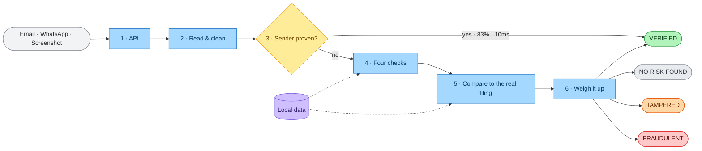
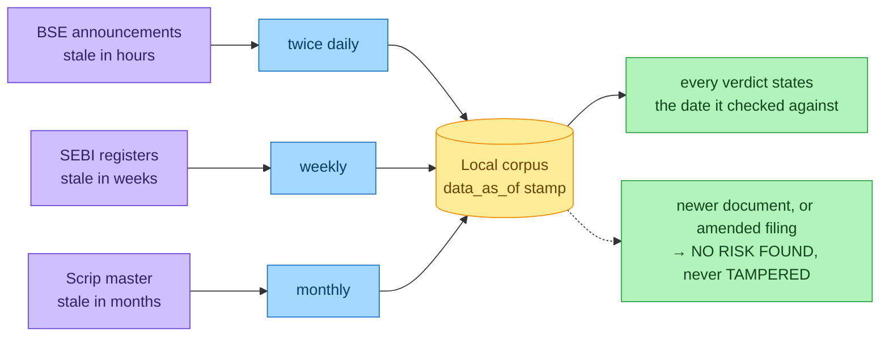

# How PhishermanAI works

A walk through what happens between a suspicious message arriving and a verdict
coming back. Written for someone who has not seen the code.

---

## The problem, in one paragraph

Every deployed anti-phishing system verifies **where a message came from**. SPF,
DKIM and DMARC do that job well. None of them verifies **what the message says**.
A fraudster who registers `canarabank-dividends.co.in`, publishes correct SPF and
DKIM records and sets a DMARC policy passes every authentication check in
existence — while impersonating Canara Bank. PhishermanAI does both: it checks
the sender *and* compares the content against what the company actually filed
with the exchange.

---

## The journey of a message



Solid arrows are the journey of one message. Dashed arrows are lookups against
local data. **No step touches the internet** — the whole path runs with the cable
unplugged.

---

## Step 1 — the message arrives

Three ways in, all reaching the same engine through `POST /verify`:

| Channel | How it is used | Speed |
|---|---|---|
| **WhatsApp Web extension** | Hover a message, click *Check this* | ~200 ms |
| **Web app** | Drop an `.eml`, paste text, upload a screenshot | ~40 ms text, ~3 s image |
| **SMTP gateway** | Verifies mail on arrival, stamps the result into headers | ~25 ms overhead |

The gateway is the one a broker or registrar would deploy; the other two are for
an individual investor.

---

## Step 2 — read and clean

Three things happen before any rule runs, and the order matters.

**Parse.** Email, plain text, image or PDF all become one normalised object. For
email, the `Authentication-Results` header is read rather than re-verified: the
receiving provider already did the cryptography, and re-implementing DKIM
validation would add failure modes without adding information.

**Strip hidden content.** Anything invisible to a human is removed — `display:none`,
white-on-white text, zero-size elements, HTML comments, zero-width characters.
This is a security control, not tidiness. Hidden text is where prompt injections
and scanner decoys live.

**Mask identifiers.** Indian securities mail is full of numbers that look like
payment destinations. Every recognised identifier is replaced with a typed
placeholder before any rule sees the text:

| Real value | Becomes | Why it matters |
|---|---|---|
| `1209870000018454` | `<CDSL_BOID>` | 16-digit demat ID, reads as a bank account |
| `ABCDE1234F` | `<PAN>` | |
| `1800 266 0050` | `<TOLL_FREE>` | NSE's helpline was read as an account number |
| `SEBI/HO/.../2026/38` | `<SEBI_CIRCULAR>` | |

A genuine CDSL holding statement was once scored **FRAUDULENT** because its BO ID
was read as a bank account, with no payment verb anywhere in the message. Masking
first removes that entire class of failure.

**Forwards are unwrapped here too.** Forwarding is how people actually submit
suspicious mail, so the message we receive is the *forwarder's* — the one to judge
is inside it. An early version flagged a user's own Gmail address as an
institution impersonator. Attached forwards keep their original signatures;
inline forwards lose them, and that is reported as *unavailable*, never *failed*.

---

## Step 3 — is the sender proven?

If a message carries a valid DKIM signature that is **aligned** (the signing
domain matches the From domain) and that domain is one we hold positive evidence
for, we answer **VERIFIED** immediately without running any content rule.

The reasoning: DKIM signs the body. A valid aligned signature already proves the
content is unmodified and the sender is who they claim. Running content rules
afterwards re-checks something already proven, and can only manufacture false
positives — which is exactly what happened to an NSE investor-awareness email
that was scored fraudulent by its own warning text about guaranteed returns.

**83% of genuine mail exits here, in about 10 ms.**

### The boundary is the important part

The short-circuit never applies to:

- **screenshots** — the sender is claimed, never proven; an image of an NSE email is not an NSE email
- **forwards** — the outer signature is the forwarder's
- **pasted text** — no headers at all
- **DKIM absent, failed, or misaligned** — anyone can sign their own mail; only an *aligned* signature proves the sender
- **any message asking for money or credentials** — DKIM proves the sender, not that their account was not compromised

That last one was found by the test suite: a tampered document with a valid
signature was returning GENUINE and never reaching tamper detection.

---

## Step 4 — the four checks

Every securities fraud has to pass through at least one of these. All four are
deterministic, offline and independently testable. None calls a model.

| Check | Question | The strong signal |
|---|---|---|
| **Entity** | Is the claimed sender real? | Does the SEBI registration number belong to *whoever is quoting it*? Fraudsters paste real numbers belonging to someone else |
| **Money** | Where does the money go? | Since Oct 2025 registered intermediaries must collect on a validated `*.brk@valid` / `*.mf@valid` handle. Money anywhere else means not a registered intermediary |
| **Claim** | Is the promise legal in India? | Guaranteed returns and assured monthly income are prohibited, not merely unlikely |
| **Delivery** | Is the link authentic? | Lookalike detection by edit distance, homoglyph folding and brand-plus-affix — plus the *sending* domain, not just body links |

### Rules match direction, not vocabulary

These two sentences share every keyword:

```
"The system will authenticate the user by sending OTP on registered Mobile"   harmless
"Please share the OTP with me"                                               severity 5
```

So a rule may not match a noun. Each of the 28 rules declares four things:

- **entity** — the noun (`OTP`, `PIN`, `password`)
- **action** — the verb that must co-occur (`share`, `send me`, `read out`)
- **direction** — `FROM_USER` or `TO_USER`
- **suppressors** — contexts that cancel it (`"an OTP will be sent to your registered mobile"`)

The engine **raises an error** if a rule with no action is given a severity above 1.
A rule that cannot express an action is a keyword, and keywords never decide verdicts.

---

## Step 5 — compare to the real filing

This is the part nothing else does.

A genuine dividend circular, from a real company, with one number edited. Every
authentication check passes, because nothing about the sender is fake. The only
way to catch it is to know what the company actually filed.

```
This document says:      ₹125.00 per share
Birla Corporation filed: ₹12.50 per share   (BSE, 09 July 2026)
```

**Finding the right filing.** Ranking candidate filings by text similarity put the
*correct* filing 2nd to 9th — the wrong filing always scored higher. Every
dividend notice a company issues is near-identical boilerplate, so prose
similarity cannot separate two of them. What can: the structured values
themselves. A record date of 10 July 2026 for Canara Bank is close to unique.

**Two rules govern the comparison.**

1. **Python compares, models do not.** A model may read "Rs 40" off an image.
   Whether 40 equals the 4 that was filed is an integer comparison.
2. **An unreadable field can never produce "tampered".** If the amount was blurry,
   the honest answer is *"we could not read this; the filed value is X"*. A false
   accusation against a real document destroys credibility faster than a miss.

---

## Step 6 — weighing it up

Four outcomes, never two. A system that only knows *safe* and *scam* has to guess
on everything it has not seen.

| Verdict | Reached when |
|---|---|
| **VERIFIED** | Cryptographically proven sender, or passing checks outnumber weak findings |
| **TAMPERED** | Matches a real filing, but a field was altered — reported with both values |
| **NO RISK FOUND** | Sender unconfirmed, but nothing asks for anything. *Not an accusation* |
| **FRAUDULENT** | One disqualifying finding, or two weak ones alongside a request |

### Not all failures are equal

Treating them equally caused every false positive this project has hit — each was
a *single* failure among many passes. Findings split in two, along one line:
**who is losing something**.

- **Disqualifying** — the sender is taking money, credentials or control *from the
  reader*. One is enough. These are claims about conduct and do not become less
  true in company.
- **Weak** — *we* could not confirm something: an unrecognised domain, a missing
  filing. These describe the limits of our knowledge, not the sender's behaviour,
  and one alone must never convict.

### The safety rail

> **A message that asks for nothing cannot defraud you.**
> No payment request, no credential request, no off-estate link means there is no
> action the reader can take that costs them anything.

Every genuine communication this system ever misjudged — NSE awareness, CDSL
e-voting, SBI statements, demat updates — asks for nothing, and all of them
resolve here before any finding list is consulted.

### Confidence gates

A FRAUDULENT verdict needs 70% confidence, and the language scales with it.
Categorical phrasing (*"This **is** a fraudulent message"*) is reserved for 85+.
Below 70, the verdict falls back rather than overclaim.

---

## The data, and keeping it current



| Source | Rows | Goes stale in | Refresh |
|---|---|---|---|
| BSE corporate filings | 8,434 | hours | twice daily, incremental |
| SEBI intermediary registers | 5,442 | weeks | weekly |
| Listed companies (ISINs) | 4,925 | months | monthly |
| Domain map | 114 | rarely | continuous, **human-reviewed** |
| Contextual rules | 28 | slowly | manual, gated by the golden corpus |

**Stale data fails safe.** If yesterday's filing is not in the corpus, the matcher
finds nothing and the verdict is NO RISK FOUND. Missing data cannot manufacture a
false VERIFIED.

**One dangerous case, and its guards.** If a company revises a dividend from ₹4 to
₹5 and we still hold the ₹4 record, a genuine new circular would be reported
TAMPERED — a confident false accusation, the worst failure available. Two guards
prevent it, and both only ever *downgrade*:

- **Never accuse across the data horizon.** If the document is dated after our
  corpus ends, a newer filing may exist that we have not seen.
- **Never accuse on an amended filing.** BSE publishes corrigenda as separate
  announcements, so a revision does not overwrite what it replaces.

Every verdict carries `data_as_of`, so *"verified against BSE filings as of
8 Aug 2026, 18:30"* is always answerable.

**The domain map is never auto-inserted.** A candidate is DNS/MX-checked, then
queued for human review. A wrong entry there is a permanent false VERIFIED — the
one error class that cannot be afforded.

---

## What it deliberately does not do

- **No LLM.** Not required, not used. The engine is deterministic, auditable and
  runs offline. Models extract prose; Python compares numbers.
- **No live scraping during a verification.** All external data is fetched
  out of band on a schedule.
- **No message content stored.** Only a SHA-256 of the normalised text plus the
  derived verdict, which is what enables campaign clustering without retaining
  anyone's mail.
- **No automation of WhatsApp.** The extension never sends, replies or forwards.
  Automating the client is what WhatsApp's terms prohibit, so it is not done at all.

---

## Where the hard bugs came from

Almost none came from writing features. They came from corpora catching mistakes:

- The **golden corpus** found a shipped bug where `"tata motors"` and
  `"tata motors passenger vehicles"` counted as two companies, silently disabling
  tamper detection on those documents.
- The **test suite** caught the short-circuit swallowing a tampered document.
- A **Devanagari test** revealed that `\b` word boundaries fail on Hindi, because
  vowel signs are not word characters — every Hindi rule had been silently dead.

That pattern is the main reason the numbers are trustworthy.

---

## Further reading

| Document | Contents |
|---|---|
| [README.md](../README.md) | Overview, setup, results |
| [eval/RESULTS.md](../eval/RESULTS.md) | Fixture metrics, confusion matrix, ablation |
| [eval/RESULTS_HARDENING.md](../eval/RESULTS_HARDENING.md) | Precision ablation over the 155-sample golden corpus |
| [extension/PRIVACY.md](../extension/PRIVACY.md) | Exactly what leaves the browser |
| [gateway/SECURITY.md](../gateway/SECURITY.md) | Gateway controls and their limits |
| `docs/*.excalidraw` | Editable diagrams |
