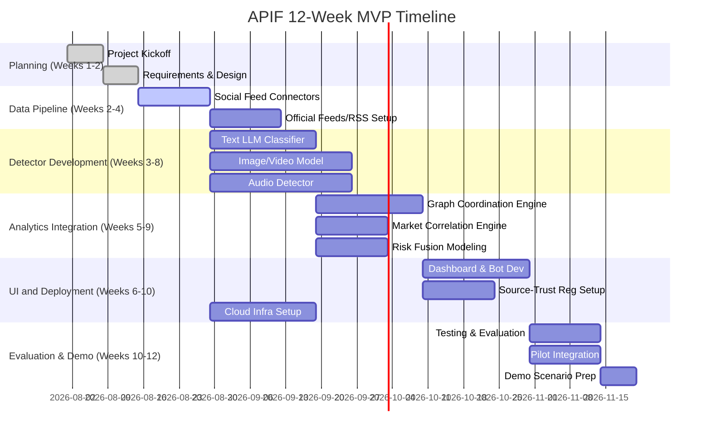

# Executive Summary  
A robust MVP for an *AI Propaganda Intelligence Framework (APIF)* must combine multimodal detection with source verification to protect Indian market participants.  The core tasks are to ingest data (social media posts, official feeds, news, market data), flag synthetic content (AI-generated text, deepfake audio/video, doctored images, phishing), and verify genuine communications (digital signatures, metadata).  We prioritize practical detectors (text and media classifiers), a trust registry for official sources, network/propagation analysis, and risk fusion to produce a “threat score.”  The system delivers user alerts via widgets, dashboards and bots, aimed especially at retail investors but also brokers, exchanges and SEBI.  Key features include: a text-LLM phishing detector; image/video deepfake classifier; voice-clone identifier; a database of verified issuers (SEBI, exchanges, companies, intermediaries) with digital-signature checks or C2PA metadata; graph-analysis for spotting coordinated amplification; market-correlation checks (price/volume spikes); and a final fusion score.  The architecture uses cloud-based streaming ingestion, scalable storage, and API/webhooks for updates.  Evaluation combines accuracy metrics on labeled deepfake/phish datasets and A/B testing with investors. Privacy (data minimization, consent) and compliance (Indian DPDP Act) guide design.  We plan a 12-week MVP sprint (see timeline below) with a small agile team.  Diagrams below outline the system architecture and information flow.  

# Scope & Stakeholders  
**Target users:** Primary target is *retail and first-generation investors*, who are vulnerable to social-media stock scams and deepfakes. Secondary users include **brokers/RIA firms** (providing client alerts), **stock exchanges and depositories (NSE, BSE, CDSL, NSDL)** (for distributing official alerts and data feeds), **listed companies’ CXOs/CIOs** (to secure their communications and press releases), and **SEBI/regulators** (to set standards and monitor market integrity).  

**Channels:** APIF must monitor most digital communication channels relevant to Indian markets: **social media** (Twitter/X, Telegram, WhatsApp public groups, YouTube, Instagram, Facebook, LinkedIn, Reddit), **email**, **SMS**, **voice calls**, and **official websites**.  The platform should scan public posts/comments and also accept user-reported samples.  Threats can originate anywhere – for example, fake “CEO video” on YouTube or WhatsApp, phishing emails, bot-boosted rumors on Twitter, or fraudulent SEBI circular via SMS.  

**Threat types:**  The MVP must cover:  
- **AI-generated text:** Hyper-personalized phishing emails, social posts, finfluencer frauds.  (Large language models now enable highly realistic scam emails.)  
- **Phishing websites/emails:** Fake SEBI/exchange websites, spoofed intermediaries’ notices.  
- **Deepfake audio/video:** Impersonations of executives (CEO/CFO interviews, regulator statements) on social channels.  
- **Edited images/circulars:** Photoshopped official memos, mutated company logos in memes.  
- **Bot campaigns:** Coordinated networks of accounts tweeting or reposting rumors to create artificial hype or fear (e.g. the SME stock pump case via Telegram/WhatsApp).  
- **Fake broadcasts:** Automated voice calls (“vishing”) using cloned voices of fund managers or regulators.  
- **Official-sounding alerts:** False investor warnings ostensibly from SEBI or exchanges.  

Crucially, APIF also handles the *dual* problem of verifying legitimate communications: currently investors have no reliable way to confirm genuine SEBI/exchange messages vs sophisticated fakes.  We will incorporate mechanisms (digital signatures, QR/C2PA metadata) to authenticate official releases (discussed below).  

# MVP Feature Priorities  
We divide features into **Must-have** (MVP core) vs **Nice-to-have**.  The MVP focuses on detection capabilities and basic verification.  

| **Feature**                          | **Priority**     | **Description**                                          |
|--------------------------------------|------------------|----------------------------------------------------------|
| Text-based scam/phish classifier     | Must-have        | Fine-tuned transformer (LLM/BERT) to flag phishing text. |
| Image/video deepfake detector        | Must-have        | CNN/ML model to spot facial or digital tampering.        |
| Voice-clone detection (vishing)      | Must-have        | Audio analysis (spectral features, ASVspoof models)      |
| Official source authentication       | Must-have        | Verify digital signatures/Content Credentials (C2PA).    |
| Data ingestion pipelines             | Must-have        | Streaming from APIs/RSS/web-scrape/social feeds.         |
| Graph-based propagation analysis     | Must-have        | Build social graphs to detect coordinated behavior.      |
| Market correlation checks            | Must-have        | Link news events to stock price/volume spikes.           |
| Risk-fusion scoring engine           | Must-have        | Combine detectors into unified threat score.             |
| Investor alert UI (dashboard/bot)    | Must-have        | One-click flagging tool (web widget, WhatsApp bot).      |
| Broker/SEBI dashboards               | Must-have        | Internal dashboards for intermediaries/regulator.       |
| Browser extension / mobile widget    | Nice-to-have     | Client-side plug-in to highlight suspicious content.     |
| Fine-grained analytics (sentiment)   | Nice-to-have     | Deeper sentiment/topic analysis of flagged content.      |
| Multilingual support                | Nice-to-have     | Extend beyond English to Hindi etc.                      |
| Explainability features             | Nice-to-have     | Explainable AI for why content was flagged.              |
| Community reporting portal          | Nice-to-have     | Allow users to report suspicious items.                  |

**Tables for prioritization:** For clarity, see tables below that compare feature priority, data sources, and detectors (including tools/APIs) in the MVP design.  

| **Category**        | **Item**                                   | **MVP Role**        |
|---------------------|--------------------------------------------|--------------------|
| Detection           | Transformer-based text classifier          | Must-have (flag phishing, rumor text) |
|                     | Image/video deepfake model                 | Must-have (spot falsified CEO media) |
|                     | Audio (voice clone) detector               | Must-have (catch vishing)         |
|                     | Bot/coordination detector (graph)          | Must-have (propaganda network)    |
| Authentication      | Digital signature / C2PA verifier          | Must-have (verify official docs)  |
| Data Pipeline       | Social API & web scrapers (SNS)            | Must-have (feed content)         |
|                     | Official RSS/API (SEBI, NSE, BSE)          | Must-have (official comms)      |
|                     | Market data API (price/volume)             | Must-have (context analysis)    |
|                     | News media API / RSS                       | Nice-to-have (news context)     |
| Reporting/UI        | Investor alert dashboard / bot             | Must-have (user alerts)         |
|                     | Broker/SEBI incident dashboard             | Must-have (monitoring)         |
|                     | Browser extension / mobile app             | Nice-to-have (ease of use)      |

**Data sources:** Key inputs include:  
- **Public social media/APIs:** X/Twitter (streaming API), Telegram channels (Bot API), Reddit API, YouTube API, Instagram/Facebook Graph (public posts), LinkedIn news. (Tools like `snscrape` can fetch posts where official APIs are limited.)  
- **WhatsApp chats:** No public API; possible scraping via WhatsApp Web (e.g. Apify bots). Realistically, we rely on data voluntarily provided by users or brokers, or monitoring public groups (e.g. Finfluencer broadcast groups).  
- **Email/SMS:** Ingest from corporate mail filters or SMS gateways (e.g. if banks can flag suspicious notices).  
- **Official feeds:** SEBI’s RSS of press releases/circulars, NSE/BSE announcements (RSS or web scraping), company filings (web queries to BSE/NSE/NACH).  
- **Market data:** Stock price and volume (via Yahoo Finance API, Bloomberg, or NSE/BSE data APIs), fundamental data for context.  
- **Web/news:** Scraping financial news websites (Economic Times, Business Standard, etc.) and fact-check sites (AltNews), as auxiliary signals.  

Below is a comparison of data sources by channel and access method:

| **Source**           | **Channel**        | **Access Method**                      | **Latency** | **Priority** |
|----------------------|--------------------|----------------------------------------|-------------|--------------|
| Twitter/X            | Social feed        | Streaming API or `snscrape` (search)   | Real-time   | High         |
| Telegram             | Public channels    | Telegram Bot API, Telethon scraper     | Minutes     | High         |
| WhatsApp             | Groups broadcast   | (No public API) Browser-scrape or Opt-in| Manual     | Medium       |
| YouTube              | Videos (CEO vids)  | YouTube Data API (comments, captions)  | Minutes     | High         |
| Instagram/Facebook   | Public posts       | Graph API or scraping (pages, hashtags)| Minutes     | Medium       |
| Reddit               | Subreddits         | Reddit API or Pushshift                | Minutes     | Medium       |
| SEBI RSS/Circulars   | Official source    | RSS feed (XML)                         | Real-time   | High         |
| NSE/BSE website      | Official Announcements| RSS/Web scrape                        | Real-time   | High         |
| Corporate filings    | BSE/NSE announcements| Web scraping APIs                     | Hours       | High         |
| Email domains        | Investor alerts    | IMAP scanning or email hook            | Real-time   | High         |
| SMS channels         | Alerts             | Twilio/OTT gateway integration         | Real-time   | Low/opt-in   |
| Market API           | Price/Volume       | Financial data APIs (Yahoo, NSE API)   | Seconds     | High         |
| News RSS/feeds       | Media articles     | News API, RSS/Google News Scrape       | Minutes     | Medium       |

# Detection Components

**Text/Classifiers:**  We use a fine-tuned large language model (LLM) or transformer (e.g. BERT/DistilBERT) to classify text posts and emails as likely phishing/propaganda or not.  The model can be trained on labeled financial scam corpora (e.g. known pump-and-dump articles) and augmented by prompting a small LLM to score suspiciousness.  Transformer-based phishing detectors are proven effective in practice (fine-tuned RoBERTa achieved high accuracy in recent studies).  This classifier processes English (and ideally Hindi/other) text in social posts, messages, and fake documents.  

**Image/Video Deepfake Detection:**  We incorporate an image/video forensic module.  This can use a deep CNN (e.g. XceptionNet or EfficientNet) trained on deepfake datasets (FaceForensics++, DFDC) to spot artifacts.  Tools like *DeepFaceLab* or *Faceswap* have detection counterparts; open-source libraries (e.g. Google’s MediaPipe FaceMesh) can detect inconsistencies in facial landmarks and blinking.  For videos, frame-by-frame analysis or an end-to-end classifier (like the winning models from the DeepFake Detection Challenge) should be used.  Because false-positive risk is high, we threshold conservatively.  

**Audio/Voice Deepfake Detection:**  AI voice clones are flagged via audio analysis.  A method is to extract speaker embeddings (e.g. using `Resemblyzer`) and compare voiceprints, but since attackers may use unheard voices, we detect anomalies instead.  We train or use open ASVspoof challenge models that analyze spectral features and neural codec fingerprints.  Recent benchmarks show high accuracy is achievable for known clones (e.g. 94% detection).  For live calls, simple heuristics (missing breath sounds, unnatural prosody) provide extra cues.  

**Propagation/Coordination Analysis:**  We build a real-time graph of social interactions (retweets, replies, mentions, shared URLs).  A coordination network is constructed: two accounts are linked if they exhibit unusually similar behavior (posting the same content within short time, or retweeting each other).  Graph features (cluster coefficient, unusual bipartite retweet patterns) are extracted.  We will apply graph-ML: e.g. train a GNN (GraphSAGE, GAT) on this dynamic graph to detect tight clusters of likely bots/trolls.  The *Aletheia* framework showed that combining topological features of a campaign with text features improves detection.  Thus, our system can flag not just single posts but entire campaigns by spotting anomalous subgraphs (e.g. many fresh accounts amplifying one message).  

**Market-Correlation Engine:**  A separate analytics module correlates flagged content with market moves.  For any suspicious message about a company, we check whether that company’s stock spiked/dipped abnormally around the same time (price/volume anomaly detection).  Techniques like pairwise correlation or Granger causality (linking rumor timestamps to market time series) can identify possible manipulation.  Sudden large trades by unknown accounts plus a viral tweet are a red flag (as in the SEBI SME case).  This module is relatively simple (time-series outlier detection), but adds evidence to the fusion model.  

**Risk-Fusion Scoring:**  The outputs of all detectors and checks are fused into a unified *risk score*.  Each alert type (text, image, voice, propagation, price correlation, source credibility) yields features.  A logistic regression or lightweight ensemble combines them.  For example: “AI-score” from LLM classification, “deepfake-score” from video model, “bot-cluster-score” from graph, “authenticity-score” from registry lookup.  Features might be binary (flagged/not) or probabilities.  We set thresholds (e.g. flag overall risk > 0.8).  This fusion ensures that content with multiple red-flags (e.g. a fake CEO video posted by a new account right before a stock surge) rates highest.  

**Source-Trust Registry:**  To verify communications, we maintain a registry of *trusted sources*: SEBI, NSE/BSE, major listed companies, RIA firms, etc.  Each entry includes validated contact channels and digital credentials.  For example, official PDF circulars from companies are digitally signed by their CFO (as required by SEBI).  We can verify an emailed “SEBI notice” by checking if it carries SEBI’s known signature or C2PA content-credential.  Fields in the registry: issuer name, domain, public key (for signature), C2PA content-credential ID, official channels (Twitter handle, email domain).  We verify authenticity by:  
- **Digital signatures:** Checking PKI signatures on documents (SEBI’s circulars, exchange announcements).  SEBI already mandated DSC usage on filings; we extend it to general comms.  Cameras even embed signatures in images.  
- **Content Credentials (C2PA):** We encourage official issuers (exchanges, companies) to attach C2PA “content credentials” metadata to images/videos they publish.  C2PA provides provenance “nutrition labels”. A quick check of these cryptographically-signed credentials can confirm a piece’s origin.  
- **Digital QR/URL verification:** Each verified source could have a short code/URL; clicking it on our app fetches metadata from blockchain or the issuer’s site.  

If a message purporting to be “from SEBI” lacks a matching signature/credential, the registry marks it as unverified.  This registry approach gives users a one-click “Trust Check” for any official-looking alert.  

# UI/UX & Alerts  
**Investor interface:** The main user-facing component is a “one-click verification” tool.  For example, a WhatsApp bot or browser extension can let an investor forward a message (video, text, email header) to APIF.  The system returns a simple verdict: *“High Risk: Likely AI-generated propaganda”* with a brief justification (e.g. “deepfake video detected; source unverified”) or *“Official Verified”*.  The investor dashboard (web or app) shows recent alerts flagged in their network (e.g. a feed of suspicious posts about stocks they follow).  Alerts include context (time, platform, images) and link to the risk score.  

**Broker/Exchange dashboard:** A separate interface for registered brokers or exchange Ops. It shows a real-time feed of threats across the market: e.g. clusters of fake news, trending manipulated tickers, upcoming suspicious social events.  Brokers could see anonymized retail queries too, to gauge threat hotspots.  Alerts can integrate into their trade desks or compliance tools (via API).  

**SEBI command center:** A top-level view for SEBI/regulators, aggregating cross-platform threats. It could have geospatial or sector filters. For instance, show all fake-newbust events on one map, trending hashtags, or flags of unverified “SEBI alerts.”  This helps regulators issue counter-notices quickly, as China’s CSRC does by dispelling rumors.  

All interfaces prioritize clarity: plain language warnings (“Fake News Alert: CEO video is fraudulent”) and actionable advice (e.g. “Verify via official channels only”). The design avoids hype and keeps technical detail minimal for end-users.  

# System Architecture  

**Diagram:** The figure below sketches the high-level system architecture. Data flows in from many channels (left side), detectors and analytics run in parallel (middle), and outcomes feed the dashboards/bots (right side). Streaming ingestion pipelines (Kafka/Kinesis) ensure low latency. A microservice architecture allows separate scaling of modules (see Fig. 1).  

 *Figure 1: Proposed APIF architecture (data ingestion, multimodal detectors, analysis modules, user interfaces).*

**Components:**  
- **Ingestion Layer (Cloud):**  Uses connectors/agents for each source: Twitter streaming clients, YouTube Data API workers, Telegram bots, email/SMS webhook listeners, and RSS feed parsers (SEBI/NSE). Messages and content are put into a stream (Kafka or AWS Kinesis) with metadata.  
- **Detection Services (Microservices):**  - *Text Detection Service:* Pulls text from stream, runs LLM-based classifier.  
  - *Image/Video Detection Service:* Saves images/video frames to storage, runs deepfake models.  
  - *Audio Detection Service:* Processes audio snippets.  
  - *Auth Checker:* Invokes registry checks (signature/C2PA) on URLs or documents.  
- **Graph Engine:**  Consumes social interactions from the stream, updates a dynamic graph (in Neo4j or Apache TigerGraph).  A scheduled job extracts clusters and graph-features, and a GNN service classifies nodes/edges as coordinated.  
- **Market Engine:**  Parallel pipelines ingest real-time price/volume for relevant securities, compare against news-times.  It flags anomalies (e.g. Bollinger band breaches) when suspicious content appears.  
- **Fusion and Storage:**  All detector outputs and metadata feed a **Risk Fusion Engine** (could be a small Python service) which computes final scores.  These are stored in a database (e.g. ElasticSearch or Cassandra) for fast lookup.  
- **Frontend/API:**  Provides RESTful API and WebSocket for UI.  The Investor bot (WhatsApp or Telegram) queries the API with content or URLs.  Dashboards (browser) pull from the risk index and display alerts/graphs (using e.g. Kibana, Grafana).  

**Deployment:** We recommend a cloud platform (AWS/GCP/Azure) for flexibility.  Components can be Dockerized and orchestrated via Kubernetes.  Streaming ensures near real-time (<30s) detection.  We target latency requirements: text classifier ~2s, image deepfake ~10-30s (GPU-accelerated), graph alerts ~1min.  

# Evaluation Plan  
We will benchmark detection performance and user impact.  

**Metrics:**  For each detector: precision, recall, F1 on held-out test sets of known synthetic content.  Example benchmarks: DFDC accuracy for video, ASVspoof EER for audio, phishing dataset accuracy.  For the fusion model, ROC-AUC on labeled true/false “events” (to be constructed).  

**Datasets:**  - *Synthetic Media:* Use public deepfake datasets (DFDC, FaceForensics++) and a corpus of voice-clone audio.  - *Phishing texts:* Use existing corpora (PhishTank, Kaggle phishing dataset) and craft Indian-market examples.  - *Official comms:* Use real SEBI/NSE circulars as positive “authentic” examples; plus fakes created by us.  - *Propagation tests:* Simulated bot campaigns on Twitter sandbox (e.g. cluster of test accounts).  - *Market context:* Historical stock tickers with known pump&dump cases (if available).  

**Baselines:**  We compare against rule-based filters (keyword scanning) and any open services (some anti-phishing APIs, open-source deepfake detectors).  

**A/B Pilot:** In a limited rollout, we could run A/B tests with brokerage customers: half see alerts, half do not, and measure if alerted users make safer decisions (survey or small trade simulations).  

# Privacy & Compliance  
Collecting social media data must respect privacy and law. We store only public posts and minimal metadata (no passwords, remove user IDs when possible).  We follow India’s DPDP Act (2023) guidelines: minimize personal data, secure storage, and allow users to opt out.  Investor-submitted content (via bot) will only be processed with consent, then discarded after analysis.  Official data (RSS, public filings) is exempt.  

All PII (names, phone numbers) scraped from posts are anonymized or hashed unless explicitly needed (e.g. for SMS feedback).  Data retention policies: keep raw content no longer than needed (e.g. 90 days), keep detection logs for audit (with encryption).  

We also obey platform TOS: e.g., Twitter’s new policies allow academic/scraping of public data with rate limits; Facebook blocks scraping, so skip or use Graph API for business accounts.  

# Rollout & Integration  
**Pilot:** We will partner with a few brokers or an exchange pilot group.  Integration steps:  
1. Onboard brokers: offer an API/SDK so they can forward suspicious content or receive alerts in their systems.  
2. Develop a WhatsApp chatbot (using WhatsApp Business API) so users can forward messages and get instant checks.  
3. Provide a browser extension (Chrome) and/or mobile app that overlays a “Verify” button next to stock news on social media.  

**APIs/SDKs:**  We’ll publish REST endpoints: e.g., `POST /api/verify` with content or link, returning JSON threat score.  An SDK (Python/JS) wraps calls for ease.  

**Phases:**  
- *Month 1-2:* MVP build and testing with internal data.  
- *Month 3:* Pilot launch with a small broker and select investor group. Collect feedback.  
- *Month 4:* Refine model (A/B results) and UI, expand to more channels (e.g. Telegram bot).  

We will document an API spec (OpenAPI) and provide demo sandbox credentials.  

# Timeline (12 Weeks)  

# Resources & Team  
- **Roles:** Data engineers (2), ML researchers (3: NLP, vision, audio specialists), DevOps/Cloud Engineer (1), Frontend/UX developer (1), Project Manager (1).  
- **Skills:** Python, PyTorch/TensorFlow, Transformers/HuggingFace, graph ML (PyG/DGL), RESTful APIs, AWS/GCP, cybersecurity knowledge (PKI).  
- **Tools/Libraries:** Python, PyTorch, HuggingFace Transformers, spaCy; TensorFlow or OpenCV for vision; SpeechBrain or Torchaudio; NetworkX or PyTorch Geometric; Kafka or AWS Kinesis; ElasticSearch for alert DB; Flask/FastAPI for services; React or Vue.js for dashboards.  Snscrape or Twint for social data collection.  
- **Compute:** A GPU instance (for deepfake models) plus cloud CPUs. Estimated 4 vCPU, 16GB RAM; 1-2 NVIDIA GPUs for training/serving. Storage: 100GB for media data.  
- **Budget:** Rough estimate ~$200K USD (engineering 3 mo, cloud infra, miscellaneous). In India terms, maybe ₹1.6–2 Cr including people costs.  

# Demo Plan  
We will script end-to-end scenarios: e.g.  
1. **Phishing email demo:** Show a phony “SEBI alert” email. The investor forwards it to the WhatsApp bot; the bot replies “FAKE – sender not registered in SEBI’s directory” (registry check) and highlights suspicious phrases.  
2. **Deepfake video demo:** Play a short fake video of a CEO. The browser extension flags it (“Deepfake detected: Face mismatch”); dashboard shows high risk.  
3. **Coordinated tweet campaign:** Seed a test tweet storm buying XYZ stock. The graph engine finds a bot cluster; triggers an alert with risk score.  
4. **Market correlation:** Simulate a false “buy ABC” rumor on Twitter and small trades; the market module detects an unusual price jump following the tweet.  
We will use synthetic/mock data (scraped or prerecorded) to populate dashboards and show flows.  The UI mockups will include annotated screenshots.

# References  
Key insights and context were drawn from industry reports and recent studies. For example, regulators worldwide warn of AI-generated market fraud.  India’s exchanges have already cautioned investors about deepfake executive videos.  Research shows GNNs and multimodal analysis improve misinformation detection.  Open standards like C2PA provide content provenance capabilities.  The tables above prioritize features and sources based on these findings and stakeholder needs.